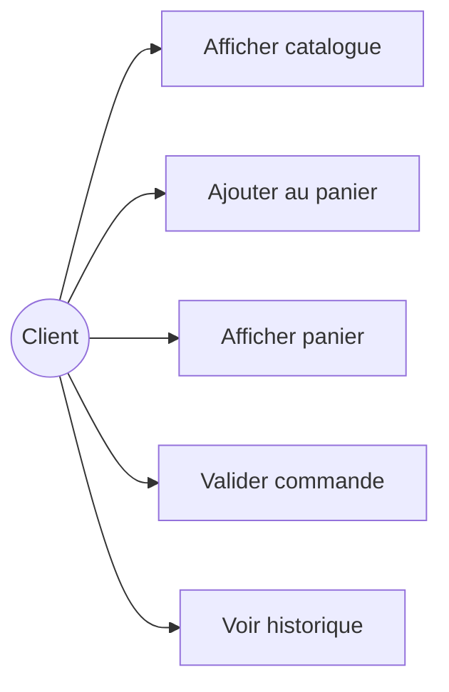
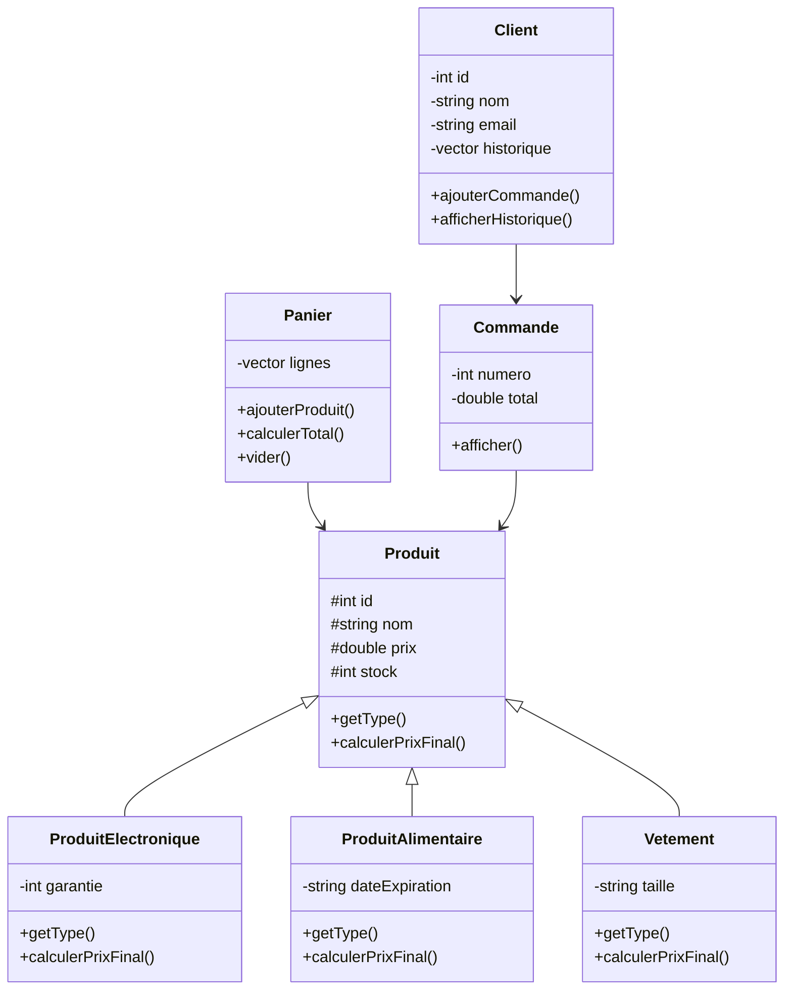
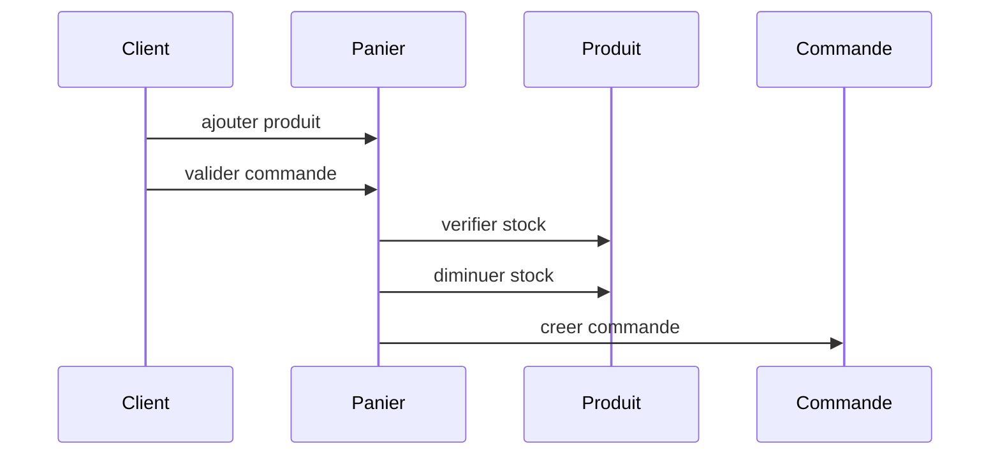

# Rapport du mini-projet Mini Amazon

## 1. Introduction

Ce mini-projet est une application console en C++ qui simule une petite
plateforme e-commerce. Le client peut consulter le catalogue, ajouter des
produits au panier, valider une commande et voir son historique.

Le projet a ete realise pour pratiquer les notions de la Programmation Orientee
Objet vues en cours.

## 2. Diagramme de cas d'utilisation

### Explication

Le client utilise le programme a travers un menu. Il peut voir les produits,
ajouter un produit au panier, afficher le panier, valider la commande et
consulter son historique.

## 3. Diagramme de classes

### Explication

La classe `Produit` est la classe principale. Les classes
`ProduitElectronique`, `ProduitAlimentaire` et `Vetement` heritent de cette
classe. Chaque type de produit a sa propre methode pour calculer le prix final.

La classe `Panier` garde les produits choisis par le client. Quand la commande
est validee, un objet `Commande` est cree et ajoute dans l'historique du
`Client`.

## 4. Diagramme de sequence

### Explication

Avant de valider une commande, le programme verifie si le panier n'est pas vide
et si le stock est suffisant. Apres la validation, le stock est diminue et le
panier est vide.

## 5. Concepts POO utilises

- Encapsulation avec les attributs prives et proteges.
- Heritage entre `Produit` et les classes filles.
- Polymorphisme avec `getType()` et `calculerPrixFinal()`.
- Surcharge des operateurs comme `<<`, `==`, `<` et `+=`.
- Fonction amie pour afficher certains objets avec `cout`.

## 6. Conclusion

Ce projet reste simple, mais il montre les bases de la POO en C++. Il nous a
permis de mieux comprendre l'organisation d'un programme avec plusieurs classes
et fichiers.
